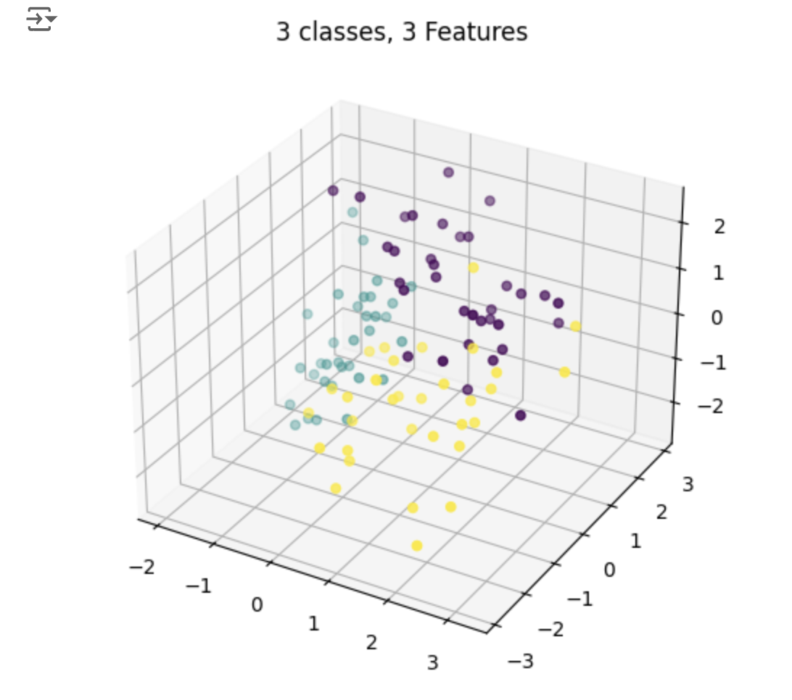

# KNN-From-Scratch
This repo shows an implementation of the KNN ML algorithm from scratch, and verification by comparing its output to a SK-Learn KNN model both trained and evaluated on the same toy dataset. 

K-Nearest Neighbors (KNN) is a unique machine learning algorithm, because it does not have any training/optimization process, it is non probabilistic, and has a relatively small number of hyper-parameters to tune. https://en.wikipedia.org/wiki/K-nearest_neighbors_algorithm KNN can be used for both classification and regression problems. KNN is a very popular but also intuitive ML algorithm, with very basic math and code implementation. 

I used the SKLearn "make_classification" method which generates synthetic classification datasets for toy examples. https://scikit-learn.org/stable/modules/generated/sklearn.datasets.make_classification.html

## How KNN works

For each sample in the test set, Repeat this process until all test samples are classified: 
1. Compute and store the vector distance between the current sample, and every sample in the training set. 
4. Sort all the distances from least to greatest. 
5. Take the k smallest distances, and count their associated labels. 
5. The most common label is the predicted label for the current sample from the test set. 

After all test samples have predictions, evaluate their accuracy using their labels. 

---

Next: SVM, Decision Trees, Logistic Regression and MLP
